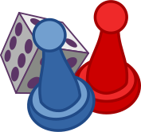

# What is the TheGameBot?
This repo contains the code for TheGameBot, a Discord bot that offers both multiplayer and single player games.



Currently very much a WIP and not yet fully developed.


## Installation
To add this bot to your server do one of the following:

#### Option 1
1. Download the files of this repo.

2. Create your own Discord Bot Token on the Discord Developer Portal and modify [bot.py](bot.py) to include it.

3. Create a virtual enviornment and install the necessary libraries with the following.

```bash
  pip3 install -r requirements.txt
```

4. In Discord Developer Portal find the setting `OAuth2 -> URL Generator`

5. Give the link Administrator privileges then open it.

6. Run your [bot.py](bot.py) whenever the bot is desired.

#### Option 2

1. Have the Discord Server's Administrator open the following link [add link here](todo.com) then add it to the server (requires to give it Administrator rights)**

**Will only work if I am hosting, which no guarentees I will be hosting indefinitely


## Usage

Once added to your server you must ```mention``` the bot with the @ symbol in your server or private messages.

It will respond with instructions of how to select a game. You will have 10 seconds to give it the game id. From there the bot will instruct you how to play the respective game.


## Current Games

- Wordle
- CodeNames*
- TicTacToe*
- BlackJack*

*Coming Soon

## Support

For support open an issue on this repo.

